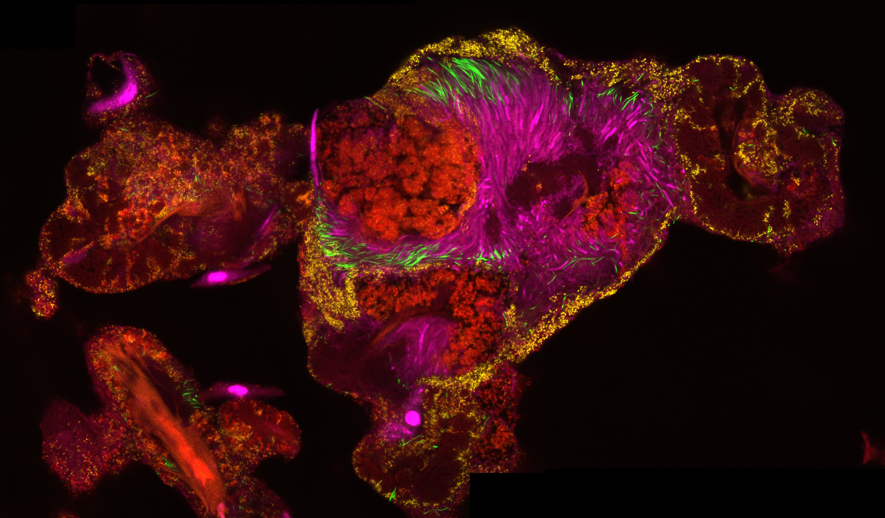

- [Home](.)
- [About me](./about-me.html)
- [Publications](./publications.html)
- [Writing](./blog.html)
- [Research](./research.html)
- [Posters](./posters.html)

# Who said scientists can't write?

Here are a few general interest articles from my days back at the Harvard based, student-run blog [Science In The News](https://sitn.hms.harvard.edu/):

- [Is it Smoky in Here? The importance of the Clean Air Act in the 21st century](https://sitn.hms.harvard.edu/flash/2019/smokey-importance-clean-air-act-21st-century/)
- [The Future of Energy Storage: A lost opportunity for the U.S.?](https://sitn.hms.harvard.edu/flash/2017/future-energy-storage-lost-opportunity-u-s/)

**Tongue dorsum scraping stained by 16S rRNA fluorescence in situ hybridization.** I obtained this image in collaboration with the Borisy Lab during the MBL physiology course.

[back](./)
