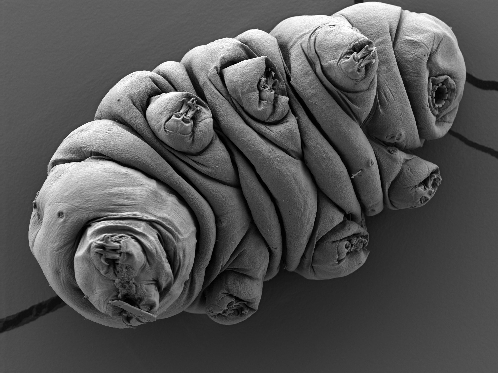

# Home
- [Home](.)
- [About me](./about-me.html)
- [Publications](./publications.html)
- [Writing](./blog.html)
- [Research](./research.html)

1. **Barber, F.**, Min, J., Murray, A. W., Amir, A. (2021). Modeling the impact of single-cell stochasticity and size control on the population growth rate in asymmetrically dividing cells. PLOS Computational Biology 17(6): e1009080. <https://doi.org/10.1371/journal.pcbi.1009080>.

2. **Barber, F.**, Amir, A., Murray, A. W. (2020). Cell size regulation in budding yeast does not depend on linear accumulation of Whi5. Proceedings of the National Academy of Sciences. <https://www.pnas.org/content/117/25/14243.abstract>

3. **Barber, F.**, Ho, P. Y., Murray, A., & Amir, A. (2017). Details Matter: noise and model structure set the relationship between cell size and cell cycle timing. Frontiers in Cell and Developmental Biology, 5, 92. <https://www.frontiersin.org/articles/10.3389/fcell.2017.00092/full>

4. Tallon, J. L., **Barber, F.**, Storey, J. G., & Loram, J. W. (2013). Coexistence of the superconducting energy gap and pseudogap above and below the transition temperature of cuprate superconductors. Physical Review B, 87(14), 140508. <https://journals.aps.org/prb/abstract/10.1103/PhysRevB.87.140508>

**Eutardigrade imaged with scanning electron microscopy.** I prepared this sample and acquired this image as part of the MBL physiology course.

[back](./)
